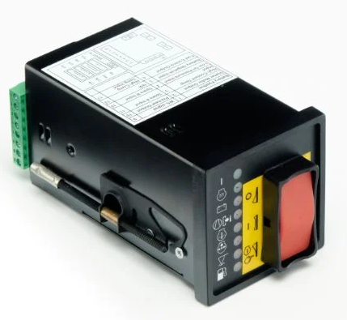

# Identification of the board

Type: 1089935597

Manufacturers number: 35597.0

Program No: CLB733

DC Volts: 12V

Picture of the device:

# Description

This board contains 3 output relays to control:

* The fuel control (on/off).
* Pre-heating.
* Sngine start.

This board contains 8 status leds at the front:

* H1 Green Fuel ON
* H2 Green Preheat (option)
* H3 Red   Charge indication
* H4 Red   Compressor outlet temperature
* H5 Red   Engine oil temperature
* H6 Red   Engine oli pressure
* H7 Red   Low coolant
* H8 Red   Low fuel

When an error is detected, the corresponding led lights up and you must switch of the unit to reset it (after fixing the cause of it).

# Repair hints

[Found issues in the past](repairs/readme.md)

# Utilities used to create the drawings

The schematic diagram is made with KiCad 6.0.11
