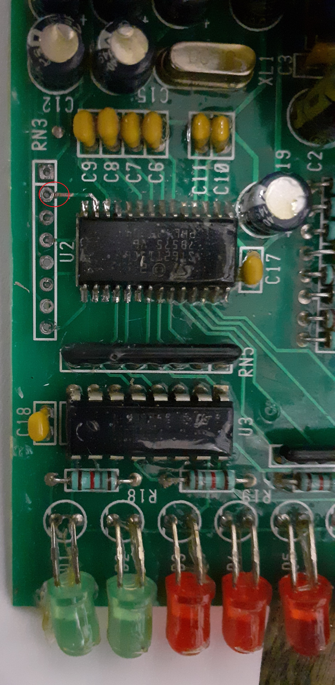

# Repairs done.

I repaired 2 of these controllers now.

## Sympthom: Device directly shows one or more RED failure leds and does nothing any more.

There was a broken trace between pion 13 of the CPU and RN3-2.
This crack was not visible because it was underneath the white silkscreen.

See the read circle here:

## Sympthom: SW2 not working / pre-heat led always off.

There was a broken trace between pin 25 of the CPU and the adjacent RN4-4 pin.
This crack was not visible because it was underneath the white silkscreen.
A similar problem as the first case.

So it looks like the boards are notorios for disconnected traces very near to the RN resistor packs?

### Back to main page [main](../../readme.md)
